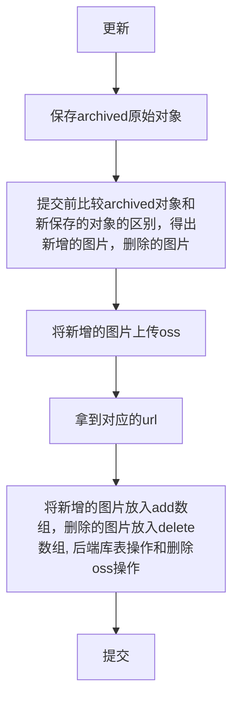

# 更新逻辑

```mermaid
graph TD;
s1[更新]
s2[保存archived原始对象]
s3[提交前比较archived对象和新保存的对象的区别，得出新增的图片，删除的图片]

b2[将新增的图片上传oss]
b4[拿到对应的url]
b5[将新增的图片放入add数组，删除的图片放入delete数组, 后端库表操作和删除oss操作]
b6[对象统一上传，统一重新写入]
b6[提交]

s1 --> s2 --> s3 --> b2 --> b4 --> b5 --> b6
```
